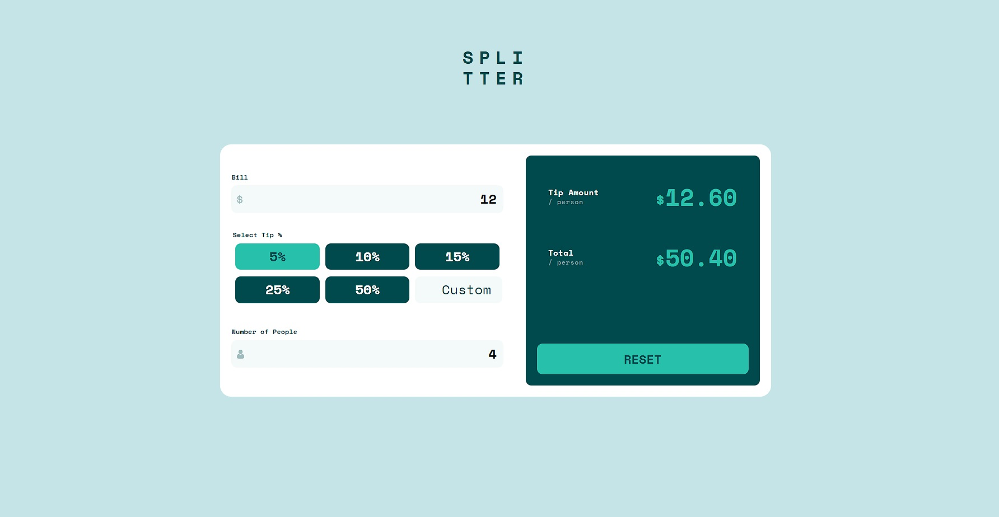

# Frontend Mentor - Tip calculator app solution

This is a solution to the [Tip calculator app challenge on Frontend Mentor](https://www.frontendmentor.io/challenges/tip-calculator-app-ugJNGbJUX). Frontend Mentor challenges help you improve your coding skills by building realistic projects.

## Table of contents

- [Overview](#overview)
  - [The challenge](#the-challenge)
  - [Screenshot](#screenshot)
  - [Links](#links)
- [My process](#my-process)
  - [Built with](#built-with)
  - [What I learned](#what-i-learned)
  - [Continued development](#continued-development)
- [Author](#author)

**Note: Delete this note and update the table of contents based on what sections you keep.**

## Overview

### The challenge

Users should be able to:

- View the optimal layout for the app depending on their device's screen size
- See hover states for all interactive elements on the page
- Calculate the correct tip and total cost of the bill per person

### Screenshot

### Links

- Solution URL: (https://www.frontendmentor.io/solutions/tip-calculator-app-using-javascript-classes-and-sass-4XlylDO0Rh)
- Live Site URL: (https://roonder-tipcalculator.netlify.app/)

## My process

- This was a really nice experience on applying my new knowledges on Classes and practicing my CSS/JavaScript. It has a really nice functionality, it can be improved tho. Built up with 2 principal classes:

  - UI - The class on charge of showing properly the info.
  - Summary - The class on charge to build up the Summary Object, do the operations and reset the object when the "Reset" button is clicked.

  If want to modify, execute the command "npm i -D" to install the developer's dependencies using Node.js. And use "npm run dev" to initialize the gulp process that compresses the SASS and JavaScript files.

### Built with

- Semantic HTML5 markup
- CSS custom properties
- Flexbox
- CSS Grid
- Mobile-first workflow
- JavaScript ES6
- Gulp [https://gulpjs.com/] - Node.js Toolkit
- Node.js [https://nodejs.org/es/] - JavaScript Enviroment

### What I learned

I improved my understanding on Classes and applying better the fundamental CSS concepts by doing just some little modifications in the end to apply the desktop layout.

### Continued development

I'll be using this knowledges to implement the Classes in my further projects and make them even more dynamic. Also this is going to help me a lot when I start to learn some frameworks and using them.

## Author

- Website - [Roonder](https://github.com/Roonder)
- Frontend Mentor - [@roonder](https://www.frontendmentor.io/profile/Roonder)
- LinkedIn - [@roonderdev](https://www.linkedin.com/in/roonderdev/)
